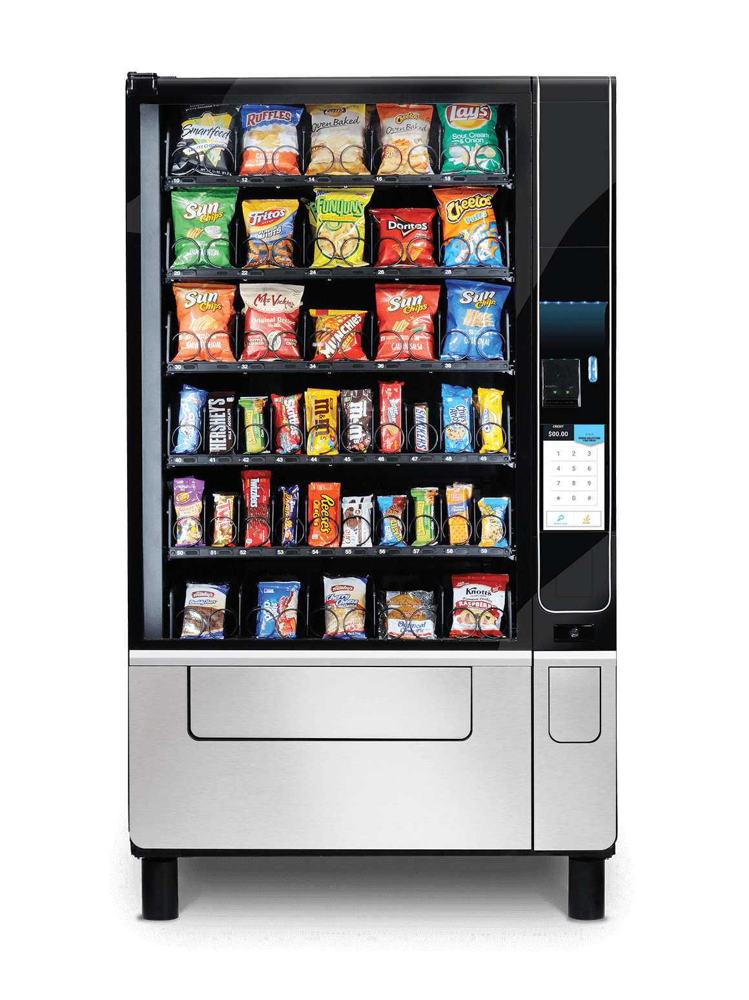

PHP-Backend Coding Challenge
=

### Setup
System requirements:
- PHP 8.1
- Composer

### Intro
Hi and welcome to Lillydoo! You are now going to participate in
a short coding test, which will test your ability to think logical,
to work independently with a given situation and environment and 
develop in a smart, goal-oriented way.

### Problem definition
Product Owner approached your with a task of developing simple CLI 
application for prototype of snack vending machine like this one:



As you might know, different vending machines can have different size 
and different type of product slot.  Our prototype will be simple and
have only 4 of them which located like on the schema below:

````
+----+----+
| 1a | 1b |
+----+----+
| 2a | 2b |
+----+----+
````
numbers "1" and "2" are standing for row and chars "a" and "b" for column. 
Keep in mind that it should be possible to adjust our app for another 
configuration of working area 2x3, 4x2, etc (see FirmwareInterface).

To keep implementation simple, let's assume that products in our machine can never go out of stock.

The result should be printed on the screen with the count, and the 
total amount of purchased products. As well as a table which tells 
the customer in which coin combination the machine will present the change.

Let's agree that machine can accept ony bills: 5,10,20,50 and can give change
only in coins: 0.01, 0.02, 0.05, 0.10, 0.20, 0.50, 1.00, 2.00

### Example
```
dev@lillydoo.com:/home/coding-challenge$ php bin/console show-stock
+---+-------+-------+
|   |   a   |   b   |
+---+-------+-------+
| 1 | Mars  | Coke  |
+---+-------+-------+
| 2 | M&M's | Pepsi |
+---+-------+-------+

dev@lillydoo.com:/home/coding-challenge$ php bin/console purchase 2a 2 10.00

You bought 2 packs of M&M's for 5.98€, each for 2.99€

Your change is:
+-------+-------+
| Coins | Count |
+-------+-------+
| 2     | 2     +
+-------+-------+
| 0.02  | 1     +
+-------+-------+
```

### Pitfalls
Don't forget about edge case scenarios like:
- given less money than total cost of products should not allow consumer to buy products and inform him/her about the problem.

### Hints
- Follow predefined project structure
- Going with TDD approach and writing unit tests upfront will help you to not miss important parts of implementation
- Static analysis tools will help to avoid errors which are hard to spot from first sight
- We like slevomat ;)
